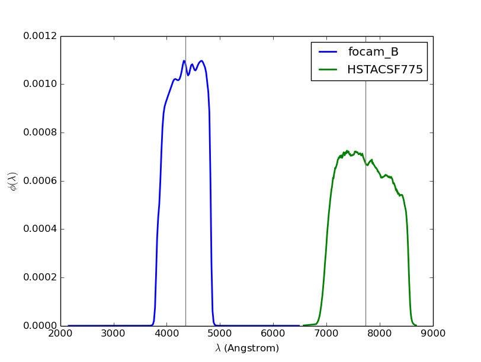

# filters
Classes to store and load photometric filter transmission curves

##Usage

You have a bunch of ASCII files with filter transmission curves. Each
file has two columns, wavelength lambda and transmission curve
phi(lambda):

```python
In [1]: ll /home/you/filters/
total 700
-rw------- 1 robert   3752 Oct 21  2014 focam_B.dat
-rw------- 1 robert   3480 Oct 21  2014 focam_V.dat
-rw------- 1 robert  37021 Oct 21  2014 HSTACSF435.dat
-rw------- 1 robert  60906 Oct 21  2014 HSTACSF606.dat
-rw------- 1 robert  49227 Oct 21  2014 HSTACSF775.dat
```

This is how you can load all these filters into a nice library. The
backend for storage is a HDF5 file:

```python
In [2]: import filters
In [3]: path, filterlist = filters.load_filters_from_directory('/home/robert/science/grappa/filters/microns',suffix='.dat',lambdafactor=1e4)
```

`lambdafactor`, if not unity, can be used to scale the wavelength from
the ASCII file some some other units. phi(lambda) is scaled
appropriately, such that \int d\lambda \phi(\lambda) = 1. is
maintained. Here, lambda was in micron, and is now in Angstroms. The
members of `filterlist' are instances of `Filter` class.

```python
In [4]: filt = filterlist[0]
In [5]: filt.clam   # the central wavelength (automatically computed)
Out[5]: 4348.2207805894477
```

Now make a filter library:

```python
In [6]: lib = filters.FilterLib('myfilters.hdf5')  # if myfilters.hdf5 doesn't exist, it will be created
In [7]: lib(filterlist)  # this stores the filters in the HDF5 file
In [8]: lib.close()   # don't forget to close
```

In future, if you want to use the filters:

```python
In [1]: import filters
In [2]: lib = filters.FilterLib('myfilters.hdf5')  # if myfilters.hdf5 already exist, it will be simply opened for reading
In [3]: filternames = lib.filternames()
In [4]: filternames
Out[4]: 
['focam_B',
 'focam_V',
 'HSTACSF435',
 'HSTACSF606',
 'HSTACSF775',
 'HSTACSF850',
 ...]
In [5]: selected_filternames = ['focam_B','HSTACSF775']  # select some filters
In [6]: selected_filters = lib(selected_filternames)
Using filter normalization 'area'.
clam_ 4348.22078059
clam_ 7730.56351334
In [7]: lib.close()
In [8]: selected_filters
Out[8]: 
[<filters.Filter instance at 0x7f0cb3b501b8>,
 <filters.Filter instance at 0x7f0cb3b50200>]
```

Plot the filters:

```python
In [9]: import pylab as p
In [10]: for filt in selected_filters:
    p.plot(filt.lam,filt,phi,ls='-',label=filt.name)
    p.axvline(filt.clam)
In [11]: p.legend()
In [12]: p.xlabel(r'$\lambda$ (Angstrom)')
In [13]: p.ylabel(r'$\phi(\lambda)$')
```



Confirm normalization:

```python
In [10]: from scipy import integrate
In [14]: for filt in selected_filters:
    print filt.name, integrate.trapz(filt.phi,filt.lam)
focam_B 1.0
HSTACSF775 1.0
```
